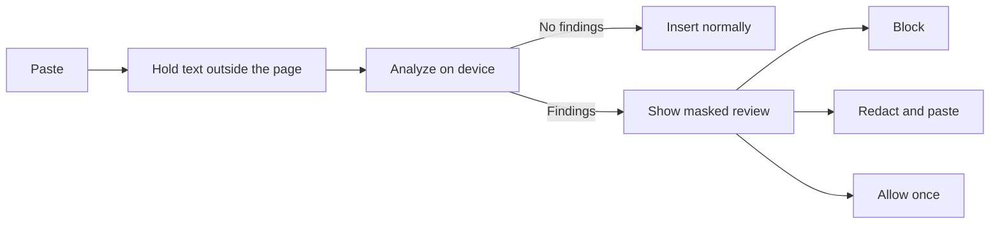

# Sentinel

**An on-device privacy firewall for prompts and clipboard pastes.**

Sentinel catches sensitive values before they reach an AI chat, form, or other
website. It analyzes text locally, shows only masked evidence, and lets the
user block, redact, or explicitly approve the paste.

[Launch the standalone demo](https://jhanvimehndiratta.github.io/hackaholics/)

> All examples included with Sentinel are synthetic. Never use real secrets in
> a presentation or test.

## The problem

Prompts often begin as copied logs, configuration files, support messages, or
environment snippets. Those sources can quietly contain credentials, private
network details, or personal information. A warning after submission is too
late.

Sentinel adds a decision point **before insertion**:

## Two ways to experience Sentinel

### Standalone web demo

The GitHub Pages demo is the fastest way to present the detection and review
flow. It runs the browser engine directly on the page—no account, backend, or
extension is required.

- Choose **Sensitive input**, then select **Inspect locally**.
- Review the finding type, severity, and masked evidence.
- Select which findings to remove.
- Choose **Redact & paste** to copy the sanitized result.
- Choose **Allow once** to copy the original only after explicit approval.
- If browser clipboard access is unavailable, use the visible manual copy
  control.

The page is a controlled simulation. It cannot intercept pastes on other
websites and does not install the browser extension.

### Browser extension

The unpacked extension protects supported editors on normal HTTP and HTTPS
pages. It cancels each supported paste synchronously, analyzes the captured
text locally, and inserts nothing sensitive before a decision is made.

| Decision | Destination result |
| --- | --- |
| **Block** | The destination remains unchanged. |
| **Redact and paste** | Only the sanitized text is inserted. |
| **Allow once** | The original text is inserted after explicit approval. |

The extension preserves the original selection or caret when approved text is
inserted, including in framework-controlled fields and `contenteditable`
editors.

## A presentation flow

A short demonstration can show the complete value proposition:

1. Open the standalone demo and run **Sensitive input**.
2. Point out that every finding displays masked—not raw—evidence.
3. Choose **Redact & paste** and show the sanitized clipboard result.
4. Run **Strict entropy** to demonstrate Strict policy detection.
5. Switch that same example to **Balanced** to show the policy difference.
6. Run **Benign UUID** to show a zero-finding false-positive check.
7. In a separate browser tab with the extension loaded, paste a synthetic
   sensitive sample and demonstrate **Block**, **Redact and paste**, and
   **Allow once**.

## Detection policies

| Policy | Designed for | Detection behavior |
| --- | --- | --- |
| **Balanced** | Everyday protection with fewer false positives | Detects credential-bearing database URLs, AWS and GitHub tokens, named API keys and passwords, email addresses, and private IPv4 addresses. |
| **Strict** | Higher-sensitivity review | Includes every Balanced rule and flags high-entropy values when they appear in a named secret context. |

Strict entropy detection is contextual rather than a blanket rule. The
**Benign UUID** sample demonstrates that an ordinary identifier can pass with
zero findings under Balanced policy.

## Privacy guarantees

- **On-device analysis:** detection and redaction run in the browser.
- **No analysis uploads:** prompt and clipboard text are not sent to a remote
  analysis service.
- **Masked evidence:** review screens render each finding's safe preview, never
  the raw matched value.
- **Pre-insertion protection:** sensitive text stays outside the destination
  DOM until the user explicitly allows it.
- **Fail-closed behavior:** if policy lookup, analysis, or approved insertion
  fails, the original paste remains blocked.
- **Local site policy:** protected mode is the default; paused-site exceptions
  are stored locally and can be reviewed or reset from the extension popup.
- **Minimal audit content:** decisions and finding categories can be recorded
  without storing raw prompt or clipboard values.

## Supported browser fields

Sentinel protects:

- `textarea` elements
- `input` elements with `text`, `search`, `url`, or `email` types
- `contenteditable` regions, including nested editing targets

Password fields are intentionally excluded. Browsers also prevent extensions
from running on protected pages such as internal settings and extension
management screens.

### Why broad page access is requested

The extension runs on ordinary websites so it can stop a supported paste
before the destination receives it. That access is used to listen for paste
events, perform local analysis, insert an approved result, and display the
review interface. Sentinel has no remote analysis endpoint or telemetry.

Protection can be paused for a specific origin from the extension popup. A
paused origin remains visible in the local paused-sites list and can be
resumed at any time.

## Install the extension from source

Sentinel is distributed as an unpacked Chromium extension for the
presentation build.

1. Download or clone this repository.
2. Open `chrome://extensions` in Chrome or `brave://extensions` in Brave.
3. Enable **Developer mode**.
4. Select **Load unpacked** and choose the repository's `extension` folder.
5. Reload any website tabs that were already open.

GitHub Pages demonstrates the product but cannot install or activate the
extension.

## Architecture

Sentinel uses one deterministic detection model across its interfaces:

- A shared browser engine performs local analysis and redaction.
- The standalone demo presents the policy and decision workflow.
- The extension adds synchronous paste interception and site-level controls.
- A Python reference implementation generates parity fixtures for independent
  verification of browser behavior.

No backend is required for the standalone demo or extension.

## Validation

Automated tests cover browser and reference-engine parity, masked evidence,
deterministic redaction, policy differences, clipboard fallbacks, synchronous
paste interception, fail-closed behavior, selection restoration,
framework-controlled fields, nested `contenteditable` targets, site policy,
and extension packaging.

## Scope

Sentinel is a focused, deterministic safety layer. It complements—not
replaces—enterprise data-loss prevention, secret rotation, access controls,
and incident response.

## License

Released under the [MIT License](LICENSE).
